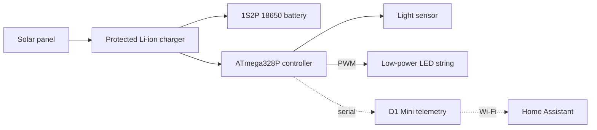
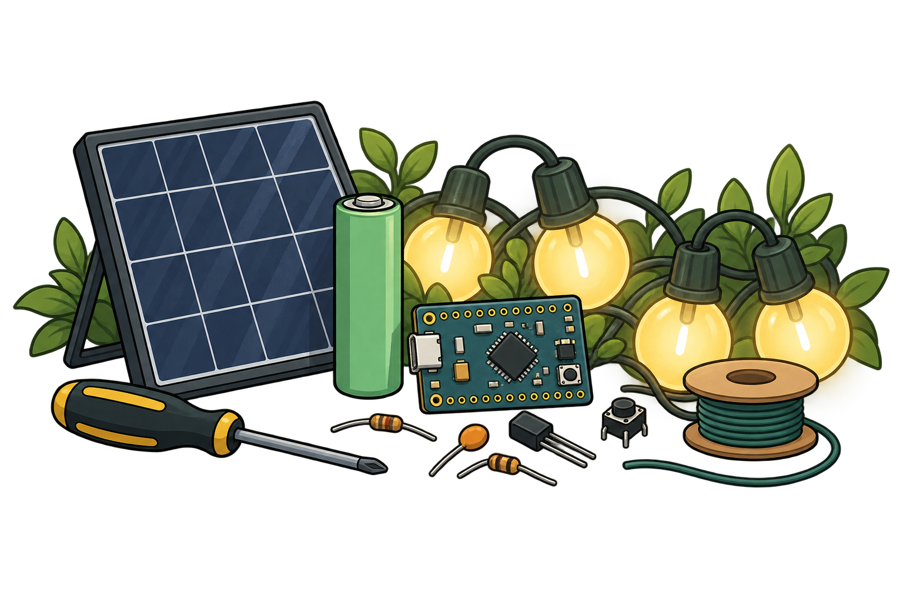

# Solar Lights Lite

Solar Lights Lite is a modular, low-power solar lighting system you build
yourself from common hobby modules. A small panel charges a protected Li-ion
battery; an ATmega328P controller sleeps most of the time, detects dusk with a
light sensor, and runs a **low-power LED string** from dusk to dawn. An
optional Wemos D1 Mini reports everything to Home Assistant.

It is also a learning project. Each module – power, controller, lighting,
sensor, telemetry – is built and tested on its own, so along the way you
practise soldering and SMD rework, read datasheets, program an AVR over ISP,
write low-power embedded C++, parse a serial protocol in ESPHome, and build
Home Assistant dashboards and automations.

---

## Low-power lights only

The controller drives the LED string **directly by PWM from pin D9** through a
47 Ω resistor. There is no driver transistor, so the whole string must run at
20 mA or less from a 3–4.2 V supply. Small low-power LED strings are ideal;
mains lights, 12 V garden lights and conventional or legacy fittings cannot be
used. The resistor sets the current and PWM sets the brightness. Brighter
lighting needs a driver stage: see [Going further](docs/12-going-further.md).

---

## System at a glance

| Module | What it does                       | Build guide                               |
| :----- | :--------------------------------- | :---------------------------------------- |
| A      | Panel, charger, fused 1S2P battery | [Power](docs/03-build-power.md)           |
| B      | ATmega328P controller at 8 MHz     | [Controller](docs/04-build-controller.md) |
| C      | Low-power LED string on D9         | [Lighting](docs/05-build-lighting.md)     |
| D      | Light sensor and test button       | [Sensor](docs/06-build-sensor.md)         |
| E      | D1 Mini telemetry (optional)       | [Telemetry](docs/07-build-telemetry.md)   |
| F      | Enclosure and final assembly       | [Commissioning](docs/10-commissioning.md) |

### Telemetry tiers

| Tier | Name                 | Role                               |
| :--- | :------------------- | :--------------------------------- |
| 0    | Standalone           | Lights only, no Wi-Fi              |
| 1    | Advanced Telemetry   | Always-on commissioning instrument |
| 2    | Production Telemetry | Hourly battery-powered reporting   |

**Advanced Telemetry is the road to a finished installation.** While you build,
calibrate and soak-test, it shows every decision the controller makes in Home
Assistant. When the system passes its acceptance gates, you reflash both boards
and move the D1 Mini to battery power for low-power production reporting. The
wiring stays the same.

---

## What you need

- The parts for each module: [parts, tools, skills and safety](docs/02-parts-and-tools.md)
  and the checklist [`docs/parts-list.csv`](docs/parts-list.csv).
- A soldering iron, a multimeter and a **current-limited bench supply**.
- A USBasp programmer (or a spare Arduino Uno/Nano as ISP).
- A computer with [PlatformIO](https://platformio.org/) and a standalone
  [avrdude](https://github.com/avrdudes/avrdude) 7.x.
- For telemetry: Home Assistant with ESPHome.

---

## Build path

The docs are organised by module; build in this order, passing each
commissioning gate before moving on:

1. Read the [design overview](docs/01-design-overview.md), including the
   known limitations.
2. Prepare the controller, set its fuses and flash the `advanced` firmware:
   [controller](docs/04-build-controller.md), [firmware](docs/08-firmware.md).
3. Add the [LED string](docs/05-build-lighting.md) and the
   [sensor and button](docs/06-build-sensor.md); pass Gates 1, 3 and 4 on a
   bench supply.
4. Build and qualify the [power module](docs/03-build-power.md): Gates 2, 5
   and 6.
5. Add [telemetry hardware](docs/07-build-telemetry.md) and set up
   [Home Assistant](docs/09-home-assistant.md) in Tier 1.
6. Assemble the enclosure and run the 14-day soak (Gate 7), then switch to
   production (Gate 8): [commissioning](docs/10-commissioning.md).
7. Live with it: [operation and maintenance](docs/11-operation.md).

For a visual review of everything on one page – every guide with its drawings
inline, plus the wire schedule and parts checklist – open
[`docs/ASSEMBLY.html`](docs/ASSEMBLY.html) in a browser (download or clone the
repository first; GitHub shows HTML as source). Printable A3 drawings for every
module are in
[`docs/drawings/SolarLights_Lite_Drawings.pdf`](docs/drawings/SolarLights_Lite_Drawings.pdf).

---

## Repository map

| Path                   | Contents                                      |
| :--------------------- | :-------------------------------------------- |
| `docs/`                | Guides 01–12 and the one-page `ASSEMBLY.html` |
| `docs/drawings/`       | A3 sheets, pin map, USBasp and bench sheets   |
| `docs/reference/`      | Board photos, datasheet, LED characterisation |
| `firmware/controller/` | ATmega328P firmware and host tests            |
| `firmware/esphome/`    | D1 Mini profiles: Advanced and Production     |
| `homeassistant/`       | HA package and dashboards                     |
| `hardware/kicad/`      | KiCad schematic of the complete system        |
| `tools/`               | Drawing and wiring-data generators            |

---

## Status

Version 0.6.0 is a complete build and operate package. The reference system is
built and running with Advanced Telemetry. The remaining steps before 1.0
are: removing the regulator and power LED from the bench controller board
([guide 04, step 5](docs/04-build-controller.md#5-remove-them)), which is
deferred to the production build; the 14-day soak; charger and panel
qualification; and the Tier 2 switch-over (Gates 5–8). See [`CHANGELOG.md`](CHANGELOG.md).

This is a hobby design, not a certified product. Read the
[safety notes](docs/02-parts-and-tools.md#safety) and the
[known limitations](docs/01-design-overview.md#known-limitations) before
leaving it unattended outdoors.

---

## Why build it?

This project started with a drawer of solar panels, light strings, charger
modules and microcontroller boards bought for projects that never quite
happened. Rather than buy another ready-made solar light, the aim was to put
those parts back to work, and to understand every part of the result: why a
charger needs its current set, why a microcontroller should run at 8 MHz on a
lithium cell, how little current a well-sleeping circuit can draw, and how to
watch it all from Home Assistant. AI assistants helped along the way as a
second opinion and a patient explainer.

Could it be cheaper, simpler, or less engineered? Almost certainly. But it is
a good excuse to learn, and good fun to build.

---

## Licence

Solar Lights Lite is dedicated to the public domain under
[CC0 1.0](LICENSE): firmware, ESPHome and Home Assistant configuration, tools,
documentation, drawings and schematics. Copy, modify, build and share it for
any purpose, without asking and without attribution.

The one exception is the third-party TPS63802 datasheet in `docs/reference/`,
which remains the property of its publisher and is included for reference.
