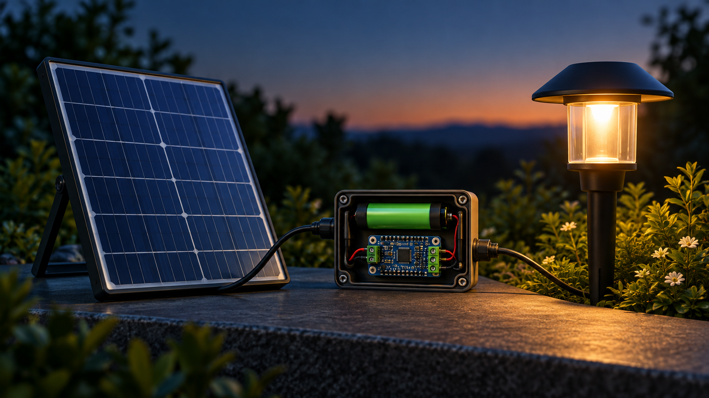
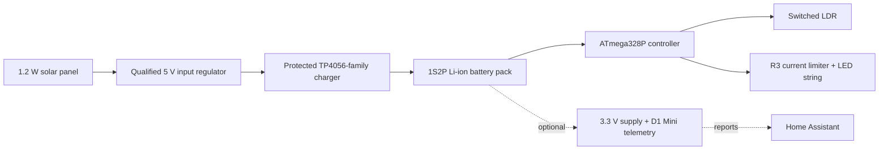
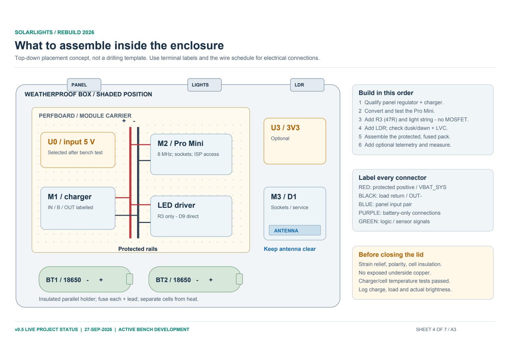

# Solar Lights Lite

Solar Lights Lite is a low-power rebuild of a small solar garden-light system. It
keeps the useful parts of the original setup—a 1.2 W panel, protected
TP4056-family charger, LED string, and a Pro Mini-sized controller—while replacing
assumptions with documented wiring, measured limits, staged tests, and a more
efficient dusk-to-dawn control strategy.

This is an open engineering project for careful bench development. It is **not yet
approved for unattended outdoor use, PCB fabrication, or assembly without the
qualification steps in the build guide**.

## What it does

- Senses ambient light and turns the LED string on at dusk.
- Runs the measured LED string directly from the controller through a current-limiting resistor.
- Protects the battery by dimming at low voltage and shutting the light off at a confirmed low-voltage threshold.
- Supports optional ESPHome telemetry for battery, Wi-Fi, and light-state reporting.
- Uses a staged assembly process so each supply, charging, controller, lighting, and telemetry function can be tested independently.

## System at a glance

## Core components

| Area | Current approach | Why it matters |
|---|---|---|
| Solar input | Existing 1.2 W panel with a qualified 5 V regulator | The panel's open-circuit voltage must be conditioned before it reaches the charger. |
| Charging and storage | Protected TP4056-family module and matched 1S2P 18650 pack | Charging current, protection topology, temperature behaviour, and cell condition require verification. |
| Controller | BTE13-010A / ATmega328P Pro Mini-class board | Runs at verified internal 8 MHz and handles LDR, button, battery monitoring, and LED control. |
| Lighting | LED string driven from D9 through R3 = 47 ohm | Bench measurement indicated about 15 mA at 3.7 V; the resistor, not PWM alone, sets branch current. |
| Telemetry | Optional D1 Mini with a separate qualified 3.3 V supply | Keeps monitoring separate from the lighting controller and makes its energy cost measurable. |

## Start here

1. Read the [build guide](SolarLights_Lite/docs/BUILD_GUIDE.md) before wiring anything.
2. Use the [illustrated assembly guide](SolarLights_Lite/docs/ASSEMBLY.html) for the power, controller, telemetry, and enclosure drawings.
3. Follow the [validation report](SolarLights_Lite/docs/VALIDATION.md) and its acceptance gates. It records both what has been demonstrated and what remains open.
4. Compile, upload and monitor only through the canonical [firmware programming procedure](SolarLights_Lite/firmware/lite_controller/PROGRAMMING.md).
5. Use the [parts list](SolarLights_Lite/docs/SolarLights_Lite_Parts_List.csv), [wire schedule](SolarLights_Lite/docs/wire-schedule.csv), and [reviewed terminal netlist](SolarLights_Lite/docs/reviewed-netlist.json) at the bench.

## Repository guide

| Location | Contents |
|---|---|
| [`SolarLights_Lite/docs/`](SolarLights_Lite/docs/) | Current assembly, component and validation documentation. |
| [`SolarLights_Lite/firmware/`](SolarLights_Lite/firmware/) | ATmega328P controller source, canonical programming procedure and optional ESPHome configuration. |
| [`SolarLights_Lite/kicad_current/`](SolarLights_Lite/kicad_current/) | Current-build KiCad reference for the direct-drive LED branch. |
| [`SolarLights_Lite/kicad/`](SolarLights_Lite/kicad/) | Frozen Rev 0.3 audit baseline; do not fabricate from it. |
| [`SolarLights_Lite/validation/`](SolarLights_Lite/validation/) | Test records, measurements, historical baselines, and captured tool output. |
| [`output/pdf/`](output/pdf/) | Printable A3 drawings and bench-reference sheets. |
| [`_archive/`](./_archive/) and [`v1_reference/`](./v1_reference/) | Superseded and original source material retained for traceability. |

## Project status

The controller firmware and direct-drive LED approach are documented and have
recorded programming and measurement evidence. The final hardware still needs the
specified regulator, charger, battery, thermal, weatherproofing, and multi-day
energy tests before it can be deployed outdoors.

See [CHANGELOG.md](CHANGELOG.md) for dated milestones and release history.
