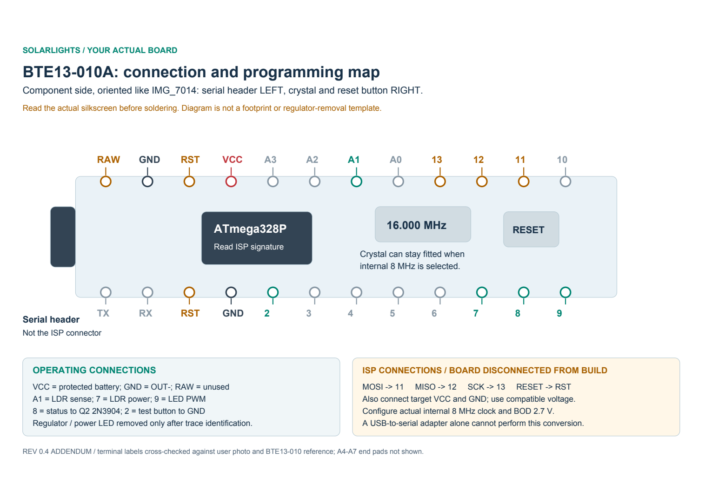

# Your BTE13-010A and transistor inventory

19 September 2026 - hardware-identification addendum to Rev 0.4

## Decision

**Retain your BTE13-010A.** The photos show the board name and a 16.000 MHz crystal. The MCU marking appears to be ATmega328P; confirm its electronic signature before programming. This is consistent with the [BTE13-010 board reference](http://talpa.dk/Electronics/BTE13-010/index.html), but your board has the additional A suffix: the reference is supporting evidence, not a guarantee that every regulator or track is identical.

The supplied inventory lists bipolar transistors only. It does not identify a MOSFET for the LED switch. Select **2N3904 for Q2**, the low-current telemetry inverter, subject to checking the actual part's pin order. Q1 remains a MOSFET selection gate. A BC337-based LED circuit is a viable alternative to develop if there are no separate MOSFETs; it is not a direct replacement in the existing drawing.

## Later inventory clarification: 2N7000 available

You subsequently confirmed a separate **2N7000**. It is an N-channel MOSFET, but it is **not selected for Q1 at 200 mA peak with 3.3-4.2 V gate drive**. The [onsemi 2N7000 datasheet](https://www.onsemi.com/pdf/datasheet/nds7002a-d.pdf) specifies on-resistance at 4.5 V and 10 V gate drive, not a guaranteed low-resistance result at 3.3 V. Threshold voltage describes the start of conduction, not a fully enhanced switch. Low PWM duty does not reduce pulse current.

A substantially lower-peak-current string could be bench-evaluated with your 2N7000, checking drain voltage and LED current across 3.3-4.2 V and temperature. That is a conditional alternative, not validation of the current 200 mA pulse design. Do not rely on the MOSFET itself to limit current. Retain the BC337-based option or use a MOSFET with a specified low RDS(on) at 2.5 V, such as the previously documented AO3400A breakout.

## What changes on this board

| Item | Treatment |
|---|---|
| 16 MHz crystal | Can remain fitted if the MCU is actually configured for its internal 8 MHz oscillator. Merely compiling at 8 MHz is insufficient. |
| Clock / brownout | Proposed internal 8 MHz, BOD 2.7 V, ISP programming; retain the Rev 0.4 conversion workflow. Programming access is now user-confirmed. Preserve the working serial bootloader; ISP-only conversion is an option, not a new required action. |
| Supply | After removing/isolating the regulator, connect protected battery VBAT_SYS to **VCC** and OUT- to **GND**. Leave **RAW** disconnected. |
| Regulator | The small package by the serial/power end is the candidate regulator. Its marking is not legible enough to select pins from the photograph. Trace RAW-to-input and VCC-to-output before removal; do not guess a part number. |
| Power LED | Identify the LED/resistor branch continuously connected to VCC. Remove that LED or its series resistor, not an adjacent decoupling capacitor. The D13 indicator is a separate branch. |
| D13 LED | D13 is held low in the production sketch. During ISP it is the SCK line and may flash; do not mistake this for the always-on power LED. |
| Programming | All batteries, panel and peripheral connections removed; one target power source. A 5 V Uno-as-ISP must use target-compatible power/logic during programming. A USB serial adapter alone does not set clock fuses. |
| Pin locations | This clone differs physically from some Pro Mini layouts. Follow the photographed silkscreen and the board-specific drawing, not a generic socket footprint. |

The [Microchip ATmega328P documentation](https://www.microchip.com/en-us/product/atmega328p) defines the clock/voltage limits. [MiniCore](https://github.com/MCUdude/MiniCore) provides a documented internal-8-MHz and brownout configuration workflow. Neither verifies the actual board's fuses or chip identity until read back.

## Board-specific visual

[Printable pin map](../../output/pdf/BTE13-010A_Pin_Map.pdf) | [Editable vector map](BTE13-010A-pin-map.svg)

## Exact connections used by the proposed build

Top/component view as your front photo: serial header to the left; crystal and reset button toward the right. Check labels before soldering. MCU port names below are logical names, not physical IC pin numbers.

| Board label | MCU signal | Destination / role |
|---|---|---|
| VCC | VCC / AVCC supply | Protected VBAT_SYS after board regulator removal |
| GND | Ground | Protected OUT- / GND_LOAD |
| RAW | Regulator input | Leave unconnected |
| A1 | PC1 / ADC1 | LDR / 100k midpoint |
| 7 | PD7 | Switched supply to LDR |
| 9 | PB1 / OC1A | R6 100 ohm -> Q1 gate in MOSFET version |
| 8 | PB0 | R8 47k -> Q2 2N3904 base |
| 2 | PD2 | Test button to GND |
| 11 | PB3 / MOSI | ISP only; no mode jumper fitted |
| 12 | PB4 / MISO | ISP only |
| 13 | PB5 / SCK | ISP only; onboard indicator may load this line |
| RST | PC6 / RESET | ISP reset; either verified RST pad |
| A0, A4-A7 | Analog / I2C pins | Not used in Rev 0.4 |
| TX, RX, DTR | Serial / auto-reset | Not a substitute for the ISP interface |

ISP connects **MOSI->11, MISO->12, SCK->13, programmer RESET->RST, target VCC and GND**. Programmer connector numbering varies. Do not connect the programmer's reset output to the board's DTR capacitor input.

## Inventory assessment

| Available part | Role in this build | Qualification |
|---|---|---|
| **2N3904** | Selected Q2 telemetry inverter | Small collector current from 10k pull-up (~0.33 mA plus internal pull-up); 47k base resistor, 100k base-emitter pull-down. Verify E/B/C on the actual brand. |
| BC547 / BC548 / BC549 / BC550 | Q2 alternatives | Appropriate small-signal role; do not treat these as the 200 mA LED switch. |
| **BC337** | Preferred listed candidate for a BJT LED-switch alternative | Needs a base-current budget, suitable driver, measured VCE(sat), LED limiting and switching tests. No Q1 substitution approved yet. |
| 2N2222 / S8050 / S9013 | Other BJT LED-switch candidates | Actual maker, package pinout and ratings matter; kit name alone is insufficient. |
| BC517 | NPN Darlington | Higher on-state voltage consumes scarce LED voltage headroom; not preferred here. |
| PNP assortment | Possible driver components | Requires a deliberately redesigned circuit; not interchangeable with Q1. |

At a 200 mA LED pulse current, a conservative forced gain of 10 implies about **20 mA base current**. That is not a universal transistor specification, but demonstrates why driving a BJT like a MOSFET is inappropriate. Low PWM duty reduces average consumption, not this instantaneous base-current requirement. A dedicated driver may be needed. At 12/255 duty for 14 hours, 20 mA base drive alone adds about **13.2 mAh/night**, plus switching/driver losses.

Alternatively, reducing the string's **peak** current permits a lighter BJT drive, then duty can be chosen for the desired average brightness. That requires a new measured LED/resistor design and revised energy budget. It should be considered if avoiding any MOSFET purchase is the priority.

The [onsemi BC337 datasheet](https://www.onsemi.com/pdf/datasheet/bc337-fsc-d.pdf) specifies saturation at explicit collector/base currents; its high small-signal gain is not a guarantee of low drop with arbitrary base drive. The [onsemi 2N3904 datasheet](https://www.onsemi.com/pdf/datasheet/2n3903-d.pdf) supports its use as Q2. Its 200 mA absolute maximum is not a reason to choose it for continuous 200 mA LED pulses without design margin.

## Inventory correction

The original attachment is preserved unchanged in `references/transistor-inventory-original.md`; the file in Downloads was not edited.

**S9013 is normally NPN, not PNP.** The [Fairchild SS9013 manufacturer datasheet](https://media.digikey.com/pdf/Data%20Sheets/ON%20Semiconductor%20PDFs/SS9013.pdf) identifies the family as NPN. Verify actual kit samples with a transistor tester or diode test, especially where packaging labels disagree. With this one classification corrected, the inventory's existing count assumptions give **15 NPN types / 1,340 pieces and 10 PNP types / 940 pieces**, total unchanged at 2,280. Kit A quantities remain assumed and A/C may be duplicate labels; this is not a physical stock count.

## Still needed

Programming access is confirmed by the user's successful 6,488-byte flash. The attached working source requests 19200 but needs a 38400 monitor, strongly indicating a 16 MHz runtime with an 8 MHz build; verify/correct the actual clock; see [hardware result](../validation/user-hardware-upload.md). The separately available 2N7000 has now been assessed above; a suitable Q1 or reduced-peak-current circuit is still to be selected. Regulator selection, LED peak-current measurement and charging-temperature qualification remain open from Rev 0.4. The new photos do not establish those facts.

---

## Q1 disposition - direct pin drive, 20 September 2026

The string has now been measured: 2.56 V drop, no significant dynamic resistance, so
the series resistor sets the current ([measurement](../validation/led-string-measurement.md)).
The user accepts the brightness at approximately 15 mA. That is the reduced-peak case
described above, and at that current the ATmega328P pin can drive the branch itself.

| Ref | Rev 0.4 | Now | Reason |
|---|---|---|---|
| Q1 | MOSFET, unselected | **Not fitted** | 15 mA is inside a pin's rating |
| R6 / R7 | 100 ohm gate / 100k pull-down | **Not fitted** | Gate parts exist only for a MOSFET |
| R3 | Value TBD | **47 ohm** to start, 56 ohm if pin margin is preferred | Measured string |
| F1 | 0.5 A LED branch fuse | **Not fitted** | The branch is no longer fed from the battery rail |
| Q2 | 2N3904 | Unchanged | Telemetry inverter is unaffected |

Pin current, taking the AVR high-side source resistance as approximately 30 ohm at this
supply. That figure comes from the datasheet output-voltage-versus-source-current
curves; it is a typical characteristic, not a specified parameter, and it varies with
part, supply and temperature. Bench-measure before accepting these numbers:

| VBAT | R3 = 47 ohm | R3 = 56 ohm |
|---|---:|---:|
| 4.20 V | 21 mA | 18 mA |
| 3.70 V | 15 mA | 13 mA |
| 3.40 V | 11 mA | 9 mA |

Limits and consequences:

- Absolute maximum is 40 mA per pin; 20 mA is the usual working figure. 47 ohm reaches
  approximately 21 mA on a full cell, so either accept that excursion, cap commanded
  duty above 4.0 V, or fit 56 ohm and lose some brightness.
- A dead short across the outdoor run is bounded by R3 plus the pin resistance to about
  55 mA (47 ohm) or 49 mA (56 ohm). That is above the absolute maximum: it is a bounded
  fault, not a designed protection. Fit R3 at the board end, not at the string.
- Total port and chip current stay well inside the 200 mA device limit for one branch.
- Brightness now falls with cell voltage by construction, which matches the Rev 0.4
  decision to remove firmware voltage compensation.
- The 2N7000 assessment above stands and is simply not needed at this current. Keep it,
  and the R6/R7/F1 parts, for any future brighter string; a switch returns with them.

This closes H07 for the present design by removing the part it concerned. It does not
affect H01, H02, H03, H05, H06 or H08 to H16.

---

## U0 / U3 candidate part - TPS63802 buck-boost breakout, 21 September 2026

You have two of a small breakout ("HL802A") built around the TI TPS63802 buck-boost
chip. Input 1.8-5.5 V, output pin-strap selectable to a fixed 3.3 V (2 A) or 5 V (1 A),
quiescent current 20-30 uA, about 10 x 8 mm. Datasheet on file at
[references/TPS63802_HL802A_datasheet.pdf](references/TPS63802_HL802A_datasheet.pdf).

**Not suitable for U0.** The actual panel (AS102-0712A) has Voc 7.6 V at 25 C, and Voc
*rises* in cold weather - H01 already flags that cold/no-load Voc is not bounded by
the old diode scheme. This module's absolute maximum input is a fraction over its 5.5 V
operating ceiling. Wiring the panel straight into it risks the regulator on the first
bright, cold, no-load morning. U0 needs a converter genuinely rated for the panel's
open-circuit voltage with margin - the existing "at least 12 V input capability" target
in BUILD_GUIDE.md stands. A basic buck module (not buck-boost) is enough here, since
Vmp (7 V) stays above the 5 V output under normal load; look for one with an input
range that comfortably clears 8-10 V, not a Li-ion-input part like this one.

**Good candidate for U3.** The telemetry supply runs off the protected battery rail
(3.0-4.2 V), which straddles 3.3 V - exactly the case a buck-boost exists for; a plain
buck can't hold 3.3 V once the cell sags below it. Set one board's solder jumper to the
3.3 V position. 20 uA quiescent is well inside the "<=0.5 mA telemetry standby" target,
and 2 A output is far more than the D1 Mini's radio bursts need. This is a candidate,
not a signed-off part: qualify it per wiring-order step 9 (3V3 within spec across
3.0-4.2 V input, at the D1 Mini's lowest-input radio burst) before relying on it.

The second board is a spare, or usable for some future 3.3 V or 5 V low-current need
elsewhere in the build - not for U0.

---

## U0 candidates - AMS1117 LDO board and MP1584EN buck module, 21 September 2026

**AMS1117 board: reject for U0.** Electrically it survives - the chip's input is
rated to 15 V, well above panel Voc even cold - so it will not be damaged. The
problem is that it is a *linear* regulator, dropping the difference between
input and 5 V as heat. Against a 1.2 W panel, that is not a rounding error: at
Imp (0.17 A) with Vin near Vmp (7 V), roughly (7 - 5) x 0.17 = 0.34 W is thrown
away as heat - close to 30% of everything the panel can produce, before the
charger even sees it. Worse, an LDO needs meaningful headroom above 5 V
(commonly 1.1-1.3 V) to stay in regulation; on an overcast morning, when panel
voltage sags toward or below about 6.2 V, it drops out of regulation and
charging stops well before the panel is actually out of usable power. A linear
regulator is the wrong architecture for a power budget this small, independent
of which exact AMS1117 board (and which fixed/adjustable output variant) is on
hand. Keep it in the kit for a mains- or USB-fed 5 V need elsewhere; do not use
it here.

**MP1584EN module (4.5-28 V in, 0.8-18 V adjustable out, 3 A): good candidate
for U0.** It is a switching buck, so it does not have the AMS1117's heat/
efficiency problem, and its 28 V input ceiling clears the panel's 7.6 V Voc
(and any further rise in cold weather) with far more margin than the project's
own "at least 12 V" target. 3 A is heavily oversized against the panel's 0.17 A
Imp, which just means it runs lightly loaded - not a problem, and quiescent
current on these boards is typically in the low hundreds of uA, negligible
against what the panel supplies while charging. Before wiring it to M1
(TP4056/DW01A) input: set the onboard trimpot and verify the output is exactly
5 V with a multimeter, no load, before connecting the charger - these boards do
not ship pre-set to 5 V. Also check, the same way the two-diode scheme was
checked under H01, that the module does not pass current backwards into a dark
panel at night (measure for reverse leakage panel-side with the panel
disconnected, or check the datasheet for input blocking) - this has not been
verified yet and should be treated as a bench check, not an assumption.

This closes the open U0 candidate search for now: MP1584EN is the accept,
AMS1117 is the reject, and both replace the earlier undecided "module TBD".
U0 remains not-yet-bench-qualified until the 5 V trim and reverse-leakage
checks above are done - see wiring-order step 1 in BUILD_GUIDE.md.
