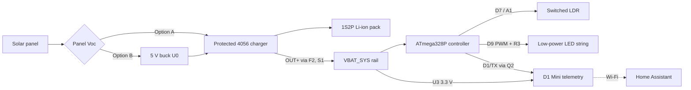

# 01 – Design overview

Solar Lights Lite is a small, modular solar lighting system. A solar panel
charges a protected lithium-ion battery. An ATmega328P controller wakes from
deep sleep every few seconds, decides whether it is dark, and drives a
low-power LED string from dusk to dawn. An optional Wemos D1 Mini reports what
the controller is doing to Home Assistant.

Every block is a separate module that you build, test and understand on its
own before joining it to the next. That makes the project a practical course in
microelectronics, soldering, low-power embedded code and home automation, as
well as a working set of garden lights.

---

## The modules

| Module | What it is                    | Build guide                          |
| :----- | :---------------------------- | :----------------------------------- |
| A      | Panel, charger, 1S2P battery  | [Power](03-build-power.md)           |
| B      | ATmega328P controller         | [Controller](04-build-controller.md) |
| C      | Low-power LED string on D9    | [Lighting](05-build-lighting.md)     |
| D      | Light sensor (LDR) and button | [Sensor](06-build-sensor.md)         |
| E      | D1 Mini telemetry (optional)  | [Telemetry](07-build-telemetry.md)   |
| F      | Enclosure and final assembly  | [Commissioning](10-commissioning.md) |

The printable drawings in [`drawings/`](drawings/) show every module at
terminal level; sheet 7 is the whole system on one page.

---

## Low-power lighting only

The lights are a **low-power LED string**: the reference string drops about
2.56 V and draws roughly 10–20 mA in total. The controller drives it
**directly by PWM from pin D9** through a 47 Ω resistor (R3). There is no
MOSFET or transistor driver.

That has three consequences you should understand before choosing lights:

- **R3 and the pin set the current; PWM duty sets brightness.** Lowering the
  duty dims the string and saves energy, but it does not make an unsuitable
  string safe.
- **The ATmega328P pin is the limit.** Its working rating is 20 mA (40 mA
  absolute maximum). Mains lights, 12 V garden lights and conventional or
  legacy light fittings cannot be connected.
- **Brightness follows the battery.** With no regulator in the LED path,
  current falls as the cell discharges – about 21 mA at 4.20 V down to 11 mA
  at 3.40 V with the reference string. This is intended.

Brighter lighting is possible, but it needs a driver stage and a new energy
budget; see [12 – Going further](12-going-further.md).

---

## How the controller works

Each wake the controller:

1. Measures its own supply voltage against the internal 1.1 V bandgap.
2. Powers the LDR divider from D7 for a few milliseconds and reads A1.
3. Advances a small scheduler (`firmware/controller/include/schedule.h`).
4. Sets the D9 PWM duty and goes back to sleep.

| Situation                   | Behaviour                              |
| :-------------------------- | :------------------------------------- |
| Day, lights off             | Power-down sleep, wakes every 8 s      |
| Dark for 300 s              | Dusk confirmed, fades up at 2 % per s  |
| Night                       | Lights at `NIGHT_DUTY_PCT` (100 %)     |
| Battery below 3.45 V        | Night duty halved                      |
| Light for 300 s             | Dawn confirmed, fades off              |
| Below 3.30 V for 30 s       | Cut-off: lights off, button locked out |
| Cut-off, then > 3.60 V, day | Normal operation resumes               |
| D2 button pressed           | 60 s test at the night level           |
| Reset                       | 10 s self-test flash                   |

While the LEDs are lit, PWM needs the timer running, so the controller uses
idle sleep and wakes every second. The switched LDR draws current only while it
is being read.

---

## Telemetry tiers

The lights never depend on Wi-Fi or Home Assistant. Telemetry is a separate,
optional module used in three ways:

| Tier | Name                 | Purpose                            |
| :--- | :------------------- | :--------------------------------- |
| 0    | Standalone           | No telemetry; controller only      |
| 1    | Advanced Telemetry   | Always-on commissioning instrument |
| 2    | Production Telemetry | Hourly battery-powered reporting   |

**Advanced Telemetry is the path to production.** While you build, calibrate
and soak-test, the D1 Mini stays awake on USB power and decodes every
diagnostic line from the controller into Home Assistant, with a dashboard built
for commissioning. When the system passes its acceptance gates you reflash both
boards and move the D1 Mini's supply from USB to the battery (U3). The wiring
does not change. See [09 – Home Assistant](09-home-assistant.md).

---

## Design decisions

- **ATmega328P at internal 8 MHz.** A 16 MHz ATmega328P is outside its rated
  operating area below about 3.8 V, which a discharging Li-ion cell reaches
  every night. At 8 MHz it is rated down to 2.7 V. The internal oscillator
  also removes any dependency on the board's crystal. The common 5 V/16 MHz
  Pro Mini is therefore fine to buy: its fuses are reset to internal 8 MHz
  ([04 – Controller](04-build-controller.md#why-the-controller-runs-at-8-mhz)).
- **No voltage regulator for the controller.** The Pro Mini runs straight from
  the protected battery rail (2.7–4.2 V is within its range), so its regulator
  and power LED are removed to eliminate their standby current.
- **Switched LDR for dusk and dawn.** Sensing panel voltage depends on charger
  loading and can back-feed an unpowered controller. A light-dependent
  resistor powered only while sampled needs no RTC, clock or network, and
  draws nothing between reads.
- **Five-minute confirmation and a threshold gap.** Car headlights, shadows
  and dusk flicker cannot toggle the lights.
- **Dusk to dawn, no clock.** Without an RTC the watchdog timer is the only
  time base, and it is uncalibrated (it varies by chip, typically 10–20 %
  slow). Dusk-to-dawn operation never needs wall-clock time.
- **Firmware cut-off plus hardware protection.** The firmware protects the
  battery from the lighting load; the charger module's DW01A protection
  remains the last line of defence for everything else.
- **Receive-only telemetry through a transistor.** Q2 inverts and level-shifts
  the controller's serial output for the 3.3 V D1 Mini, so the two boards never
  share a logic-level signal directly and the D1 Mini cannot drive the
  controller.
- **Scheduler separate from hardware.** `schedule.h` has no AVR code, so its
  behaviour is covered by host regression tests on any computer.
- **Reuse first.** Modules are chosen to be common and inexpensive, and parts
  already in a drawer are preferred where they qualify.

---

## Energy budget

These are planning figures, not measurements. Commissioning replaces them with
your own numbers ([10 – Commissioning](10-commissioning.md)). Assumptions: 14
dark hours, reference LED string at about 15 mA, Tier 2 telemetry.

| Load                                  |   100 % duty |    50 % duty |
| :------------------------------------ | -----------: | -----------: |
| LED string, 15 mA × 14 h              |      210 mAh |      105 mAh |
| Controller, 1 mA lit + 10 µA for 10 h |       14 mAh |       14 mAh |
| Controller status line, ~40 µA × 24 h |        1 mAh |        1 mAh |
| D1 Mini wakes, 24 × 20 s × 80 mA      |       11 mAh |       11 mAh |
| U3 and D1 Mini sleep, 0.2 mA × 24 h   |        5 mAh |        5 mAh |
| Other standby allowance               |        1 mAh |        1 mAh |
| **Total per day**                     | **~242 mAh** | **~137 mAh** |

On the harvest side, a TP4056-family linear charger set to 100 mA and an
assumed 2.5 equivalent full-sun hours with 20 % derating gives about
200 mAh/day; at 150 mA, about 300 mAh/day. Winter, shade and panel angle
change this dramatically. Two practical conclusions:

- Full brightness all night is marginal with a 1.2 W panel in winter. If the
  soak test shows the battery ending each night lower than the last, reduce
  `NIGHT_DUTY_PCT` or fit a larger panel.
- A bigger battery buys autonomy through cloudy spells; it cannot fix a
  persistent daily deficit.

---

## Known limitations

Read these before relying on the system unattended outdoors.

- **No cell-temperature charge inhibit.** TP4056-family modules usually have
  their TEMP input disabled. Li-ion cells must not be charged below 0 °C. In a
  climate where the enclosure can freeze, add temperature protection before
  unattended use (see [Going further](12-going-further.md)).
- **Not a power-path charger.** The load draws from the battery while it is
  charging, which can delay or confuse charge termination. Commissioning Gate 5
  checks termination with the load connected.
- **Firmware cut-off only switches the LEDs off.** The controller, U3 and the
  D1 Mini keep drawing a small current until the pack protection trips.
- **Battery percentage is an estimate** from resting voltage, not coulomb
  counting.
- **No wall-clock time.** The watchdog clock drifts; features that need real
  time (for example "off at 22:30") need an RTC or network time.
- **PWM at ~1.96 kHz** may band on some cameras.
- **A short on the LED cable is bounded, not protected.** R3 plus the pin's
  resistance limit it to roughly 55 mA, which is above the pin's absolute
  maximum. Fit R3 at the controller end so the outdoor cable is always behind
  it.
- **Telemetry reports controller state, not energy.** It does not measure
  panel voltage, charge or load current, or temperature.
